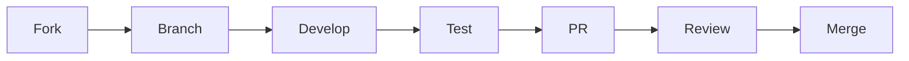

# Development Process

This guide walks through the complete workflow for contributing to SynoCommunity.

## Overview



## Step 1: Fork and Clone

### Fork the Repository

1. Go to [SynoCommunity/spksrc](https://github.com/SynoCommunity/spksrc)
2. Click **Fork** in the top right
3. This creates `yourusername/spksrc`

### Clone Your Fork

```bash
git clone https://github.com/yourusername/spksrc.git
cd spksrc

# Add upstream remote for syncing
git remote add upstream https://github.com/SynoCommunity/spksrc.git
```

### Keep Fork Updated

Before starting new work:

```bash
git checkout master
git fetch upstream
git merge upstream/master
git push origin master
```

## Step 2: Create a Branch

Always work in a feature branch, never directly on master:

```bash
# For package updates
git checkout -b transmission-4.0.5

# For new packages
git checkout -b add-mypackage

# For bug fixes
git checkout -b fix-python-armv5
```

### Branch Naming Conventions

| Type | Pattern | Example |
|------|---------|--------|
| Version update | `{package}-{version}` | `transmission-4.0.5` |
| New package | `add-{package}` | `add-mypackage` |
| Bug fix | `fix-{description}` | `fix-python-armv5-wheel` |
| Feature | `feature-{description}` | `feature-dsm72-support` |

## Step 3: Make Your Changes

### Package Updates

1. Update version in `cross/{package}/Makefile` or `spk/{package}/Makefile`
2. Update `PKG_DIST_SITE` if download location changed
3. Update `PKG_DIST_NAME` if filename pattern changed
4. Regenerate checksums:
   ```bash
   make -C cross/mypackage digests
   ```
5. Update `SPK_REV` (usually increment by 1)
6. Add changelog entry

### New Packages

1. Create package structure:
   ```bash
   mkdir -p spk/mypackage/src
   mkdir -p cross/mypackage  # if native component needed
   ```
2. Follow the [Package Anatomy](../developer-guide/basics/package-anatomy.md) guide
3. Use existing similar packages as templates

### Testing Locally

```bash
# Build for your test architecture
make -C spk/mypackage ARCH=x64 TCVERSION=7.2

# The SPK appears in packages/
ls packages/mypackage*.spk
```

## Step 4: Commit Your Changes

### Stage Changes

```bash
# Review what changed
git status
git diff

# Stage specific files
git add spk/mypackage/Makefile
git add cross/mypackage/

# Or stage all changes (be careful)
git add -A
```

### Write Good Commit Messages

```bash
git commit -m "transmission: update to v4.0.5"
```

For complex changes, use a detailed message:

```bash
git commit
# Opens editor for multi-line message
```

```
mypackage: fix build failure on armv5

The configure script was failing due to missing LDFLAGS.
Added explicit library path for cross-compilation.

Fixes #1234
```

### Commit Guidelines

- One logical change per commit
- Keep commits atomic and reviewable
- Don't mix formatting changes with functional changes
- Reference issues with `#123` or `Fixes #123`

## Step 5: Push and Create PR

### Push Your Branch

```bash
git push origin transmission-4.0.5
```

### Create Pull Request

1. Go to your fork on GitHub
2. Click **Compare & pull request** (or go to PRs and click **New**)
3. Ensure base is `SynoCommunity/spksrc:master`
4. Fill in the PR template:

```markdown
## Description
Updates Transmission to version 4.0.5.

## Changes
- Updated to upstream 4.0.5
- Fixed CVE-2024-XXXXX

## Testing
- Tested on DS920+ (x64) DSM 7.2
- Verified torrent download/upload works
- Tested web UI accessibility

## Checklist
- [x] Tested on real hardware
- [x] Updated changelog
- [x] Incremented SPK_REV
```

## Step 6: Address Review Feedback

### Responding to Comments

- Address all reviewer comments
- Explain your reasoning if you disagree
- Ask for clarification if needed

### Making Additional Changes

```bash
# Make requested changes
vim spk/mypackage/Makefile

# Commit the fix
git add -A
git commit -m "mypackage: address review feedback"

# Push to same branch (PR updates automatically)
git push origin mypackage-update
```

### Don't Force Push After Review

Once review has started:

- Add new commits instead of amending
- This preserves review history
- Squashing happens at merge time

## Step 7: After Merge

### Clean Up

```bash
# Switch back to master
git checkout master

# Update from upstream
git fetch upstream
git merge upstream/master

# Delete local branch
git branch -d mypackage-update

# Delete remote branch (optional, GitHub can auto-delete)
git push origin --delete mypackage-update
```

### Verify Publication

After merge, CI will:

1. Build packages for all architectures
2. Publish to the package repository
3. Make available in Package Center

This typically takes 1-2 hours after merge.

## Tips for Success

### Before Starting

- Check existing PRs for the same package
- Read recent commits for patterns
- Ask in discussions if unsure

### During Development

- Test early and often
- Keep changes minimal and focused
- Document non-obvious decisions

### During Review

- Be patient - maintainers are volunteers
- Be responsive to feedback
- Keep the conversation constructive

## See Also

- [Pull Request Guidelines](pull-requests.md)
- [Build Workflow](../developer-guide/basics/build-workflow.md)
- [GitHub Actions CI/CD](../developer-guide/publishing/github-actions.md)
