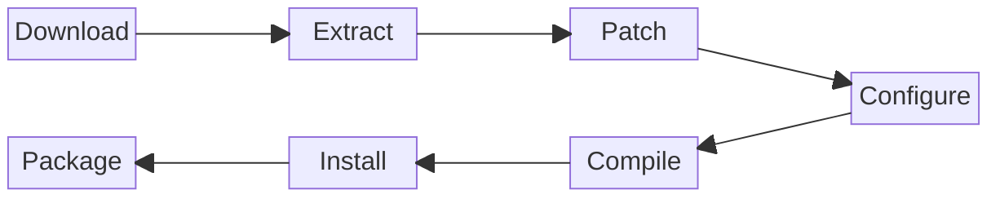

# Build Workflow

This page explains how spksrc builds work, from source code to installable SPK.

## Build Process Overview



### Build Stages

| Stage | Description | Make Target |
|-------|-------------|-------------|
| Download | Fetch source archive | `download` |
| Checksum | Verify file integrity | `checksum` |
| Extract | Unpack source archive | `extract` |
| Patch | Apply patches | `patch` |
| Configure | Run configure script | `configure` |
| Compile | Build the software | `compile` |
| Install | Install to staging | `install` |
| Package | Create SPK file | `package` |

## Basic Commands

### Build a Package

```bash
# Build for specific architecture (required)
make -C spk/transmission ARCH=x64 TCVERSION=7.2

# Build for ARM 64-bit
make -C spk/transmission ARCH=aarch64 TCVERSION=7.2

# Build for all supported architectures (uses DEFAULT_TC from local.mk)
make -C spk/transmission all-supported
```

### Clean Builds

```bash
# Clean build artifacts (keeps downloads)
make -C spk/transmission clean
```

### Debug Builds

```bash
# Show what would be built
make -C spk/transmission -n ARCH=x64 TCVERSION=7.2

# Verbose output
make -C spk/transmission V=1 ARCH=x64 TCVERSION=7.2

# Build single stage
make -C spk/transmission configure ARCH=x64 TCVERSION=7.2
make -C spk/transmission compile ARCH=x64 TCVERSION=7.2
```

## Specifying Targets

### Architecture and DSM Version

```bash
# Intel 64-bit, DSM 7.2
make ARCH=x64 TCVERSION=7.2

# ARM 64-bit, DSM 7.2
make ARCH=aarch64 TCVERSION=7.2

# Using arch-* targets
make arch-x64-7.2
make arch-aarch64-7.2
```

### Common Architectures

| ARCH | TCVERSION | Description |
|------|-----------|-------------|
| `x64` | `7.2` | Intel 64-bit (DS923+, etc.) |
| `aarch64` | `7.2` | ARM 64-bit (DS220+, DS720+) |
| `armv8` | `7.2` | ARM 64-bit Realtek (DS223) |
| `x64` | `6.2` | Intel 64-bit, DSM 6.2 |

## Dependency Handling

spksrc automatically builds dependencies:

```makefile
# In spk/transmission/Makefile
DEPENDS = cross/transmission cross/curl
```

When you build `spk/transmission`:

1. spksrc checks if `cross/transmission` is built
2. If not, it builds `cross/transmission` first
3. `cross/transmission` depends on `cross/curl`, `cross/openssl`, etc.
4. Dependencies are built recursively

### Force Rebuild Dependencies

```bash
# Rebuild a specific dependency
make -C cross/curl clean
make -C cross/curl ARCH=x64 TCVERSION=7.2

# Then rebuild the SPK
make -C spk/transmission ARCH=x64 TCVERSION=7.2
```

## Local Configuration

### local.mk

Create `local.mk` in the repository root (run `make setup` or copy from `local.mk.sample`):

```makefile
# Default toolchain versions to build for (used by all-supported target)
DEFAULT_TC = 6.2.4 7.1

# Parallel builds
PARALLEL_MAKE = max

# Custom download cache location
DISTRIB_DIR = /path/to/cache
```

### Environment Variables

```bash
# Verbose output
export V=1

# Use a proxy
export http_proxy="http://proxy:3128"
export https_proxy="http://proxy:3128"
```

## Build Artifacts

### Work Directory

Each package has a work directory per architecture:

```
cross/curl/work-x64-7.2/
├── curl-8.4.0/          # Extracted source
├── install/             # Compiled files
└── staging/             # Files for SPK packaging
```

### Output

Built SPK files are placed in `packages/`:

```
packages/
├── transmission_x64-7.2_4.0.5-1.spk
├── transmission_aarch64-7.2_4.0.5-1.spk
└── transmission_armv8-7.2_4.0.5-1.spk
```

### Download Cache

Source files are cached in `distrib/`:

```
distrib/
├── transmission-4.0.5.tar.xz
├── curl-8.4.0.tar.xz
└── ...
```

## Debugging Build Issues

### View Build Logs

Build output is visible during the build. For detailed logs:

```bash
# Enable verbose mode
make V=1 ARCH=x64 TCVERSION=7.2 2>&1 | tee build.log
```

### Build Individual Stages

```bash
# Build up to a specific stage
make -C cross/curl extract ARCH=x64 TCVERSION=7.2
make -C cross/curl patch ARCH=x64 TCVERSION=7.2
make -C cross/curl configure ARCH=x64 TCVERSION=7.2
make -C cross/curl compile ARCH=x64 TCVERSION=7.2

# Check the work directory
ls cross/curl/work-x64-7.2/
```

### Inspect the Source

```bash
# After extract stage
cd cross/curl/work-x64-7.2/curl-8.4.0/
ls -la
cat config.log  # If configure failed
```

### Re-run a Failed Stage

```bash
# Remove the stage marker and retry
rm cross/curl/work-x64-7.2/.configure_done
make -C cross/curl configure ARCH=x64 TCVERSION=7.2
```

## Parallel Builds

### Enable Parallel Builds

```makefile
# In local.mk
PARALLEL_MAKE = max
```

### Notes on Parallelism

- Build stages for a single package run in sequence
- Different architectures can build in parallel
- Dependency packages must complete before dependents start
- Some packages have race conditions; disable parallel builds if issues occur

## CI/CD Integration

spksrc uses GitHub Actions for automated builds. See [Publishing](../publishing/index.md) for details on:

- Automatic builds on push
- Building for all architectures
- Publishing to package server

## Next Steps

- **[Packaging Guide](../packaging/index.md)** - Create your own package
- **[Makefile Variables](../packaging/makefile-variables.md)** - Complete variable reference
