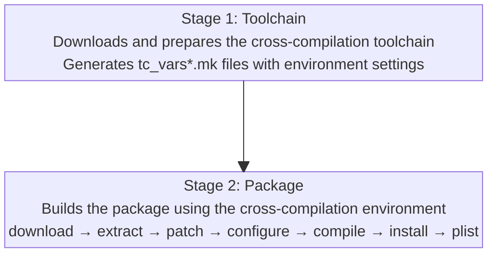

# Framework Internals

This section documents the internal architecture of the spksrc build system. It's intended for:

- **Contributors** who want to modify or extend the build framework
- **Advanced developers** who need to understand how builds work internally
- **Package maintainers** debugging complex build issues

!!! note "Developer Guide vs Framework Guide"
    The [Developer Guide](../developer-guide/index.md) covers *using* spksrc to build packages. This Framework section covers how spksrc *itself* works internally.

## Overview

spksrc is a GNU Make-based build framework that:

1. **Downloads and manages toolchains** for cross-compiling to Synology DSM architectures
2. **Provides a standardized build pipeline** (download → extract → patch → configure → compile → install → package)
3. **Generates SPK packages** compatible with Synology Package Center
4. **Handles dependencies** between packages automatically

## Key Concepts

### Two-Stage Build Process

Every cross-compilation build in spksrc follows a two-stage process:

### Directory Structure

The spksrc repository is organized into functional directories:

| Directory | Purpose |
|-----------|--------|
| `mk/` | Core build system makefiles |
| `toolchain/` | Synology cross-compilation toolchains |
| `cross/` | Cross-compiled libraries and applications |
| `native/` | Native (build host) tools and dependencies |
| `spk/` | Final package definitions |
| `kernel/` | Kernel modules (for specific packages) |

### Cookie Files

spksrc tracks build progress using "cookie" files (hidden files in the work directory). Each build stage creates a cookie when complete:

- `.download_done` - Source archive downloaded
- `.checksum_done` - Checksum verified
- `.extract_done` - Archive extracted
- `.patch_done` - Patches applied
- `.configure_done` - Configure completed
- `.compile_done` - Compilation finished
- `.install_done` - Installation to staging area complete

These cookies allow builds to resume from where they left off and prevent redundant work.

## Documentation

- **[Architecture](architecture.md)** - Detailed build pipeline and stage interactions
- **[Makefile System](makefile-system.md)** - Deep dive into the mk/*.mk files
- **[Toolchains](toolchains.md)** - How toolchains are managed and used

## Related Documentation

- [Developer Guide: Build Workflow](../developer-guide/basics/build-workflow.md) - How to use make targets
- [Developer Guide: Build Rules](../developer-guide/packaging/build-rules.md) - Available build system includes
- [Developer Guide: Makefile Variables](../developer-guide/packaging/makefile-variables.md) - Variable reference
